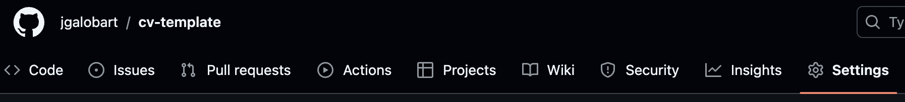
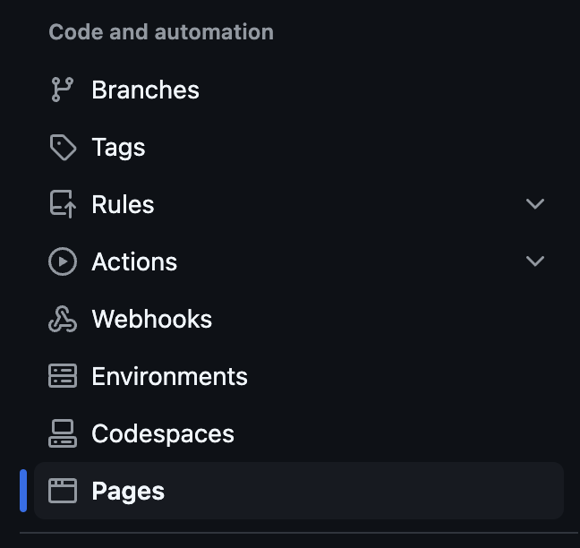
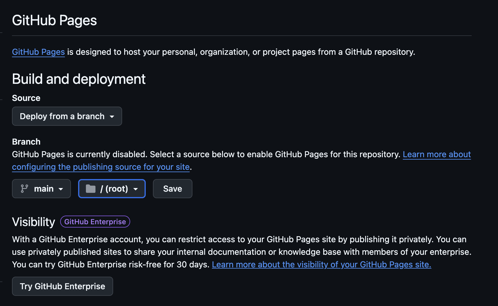

En este ejercicio prepararemos un CV mediante Markdown que alojaremos en el servicio Github Pages. Los pasos a seguir son:

# 1. Crear un repositorio en Github

- Inicia sesión en tu cuenta de GitHub y crea un nuevo repositorio.
- Asegúrate que tu repositorio es público.

# 2. Crearemos un fichero README.md

- La extensión `.md` hace referencia al lenguaje markdown, un lenguaje de marcado ligero y fácil de usar, diseñado para dar formato a texto de una manera sencilla y legible tanto en su forma sin procesar como en su forma final. La gracia es que luego es fácil convertir el formato Markdown a otros lenguajes, por ejemplo HTML.

## Elementos Comunes en Markdown

### Títulos

Para crear títulos, se usan los signos `#`. Cuantos más `#`, más pequeño es el título.

```
# Título 1
## Título 2
### Título 3
```

### Negritas y Cursivas

- **Negrita**: Se usa `**texto**` o `__texto__`.
- **Cursiva**: Se usa `*texto*` o `_texto_`.

```
**Este texto está en negrita**
*Este texto está en cursiva*
```

### Listas
- **Listas no ordenadas**: Se crean usando `-`, `+` o `*`.
  
```
- Elemento 1
- Elemento 2
```

- **Listas ordenadas**: Se numeran usando `1.`, `2.`, `3.`, etc.

```
1. Primer elemento
2. Segundo elemento
3. Tercer elemento
```

### Enlaces
Para crear enlaces, se usa `[Texto](URL)`.

```
[Google](https://www.google.com)
```

### Imágenes
Para insertar imágenes, se usa la misma sintaxis que un enlace, pero con un `!` al principio:

```

```

### Código

Para resaltar código, se usan comillas invertidas (`).

Código en línea: `` `print("Hola Mundo")` ``

Bloques de código

````
```

```
````

### Citas
Las citas se indican con el símbolo >.

```
> Esto es una cita en Markdown.
```

# 3. Configuramos Github Pages

Accedemos a `settings` del repositorio en Github



Accedemos a `pages` en el menú lateral de `settings`



Nos aseguramos de que Github Pages estará sincronizado con la rama `main`



# 4. Elegimos un theme y lo configuramos en el fichero `_config.yml`

Github nos ofrece la posibilidad de elegir entre un [listado de themes de Jekyll](https://pages.github.com/themes/). Aquí encontrarás una descripción detallada de [cómo elegir un theme de Jekyll para tus Github pages](https://docs.github.com/en/pages/setting-up-a-github-pages-site-with-jekyll/adding-a-theme-to-your-github-pages-site-using-jekyll).

El fichero `_config.yml` debe tener el siguiente formato:

```
title: Jordi Galobart Salvat
logo: "Jordi Galobart.png"
description: Full Stack developer
theme: jekyll-theme-minimal 
plugins:
  - jekyll-seo-tag # Add SEO plugin
```
